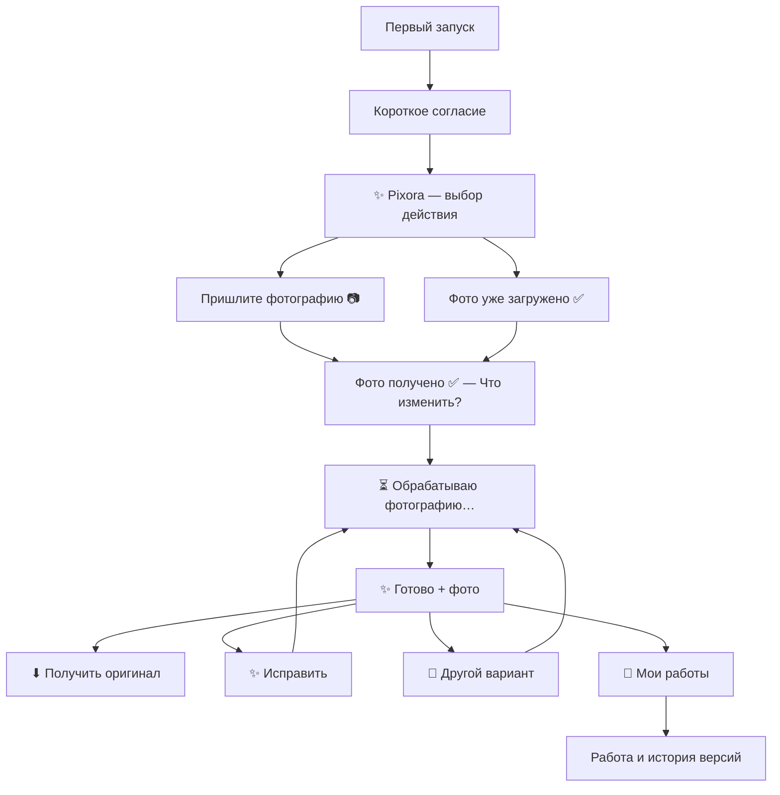

# Pixora MAX UX redesign

## Цель

Pixora ведёт человека к готовой фотографии без технических объяснений. На каждом экране есть один понятный следующий шаг, а главное действие стоит первой кнопкой.

Этот спринт меняет только presentation-слой MAX: тексты, кнопки и порядок экранов. `DemoService`, Gallery, PaymentIntent, Storage, SQLite, OpenAI, лимиты, watermark, TTL, retention, transport, owner-only и observe-only не изменены.

## Старый и новый сценарий

| Этап | Было | Стало |
|---|---|---|
| Первый запуск | Длинное описание демо, watermark, лимита и будущей оплаты | Короткое согласие: «Продолжая, вы принимаете условия использования» |
| Главное меню | Отдельное вступление и отдельный экран выбора | Один экран: «✨ Pixora — Что хотите сделать?» |
| Выбор задачи | Неодинаковые названия и эмодзи | Девять коротких продуктовых действий в фиксированном порядке |
| Загрузка | Фото запрашивалось даже при сохранённом исходнике | Новый пользователь видит «Пришлите фотографию 📷», вернувшийся сразу продолжает с сохранённым фото |
| Фото загружено | Три абзаца рекомендаций | «Фото получено ✅ — Что изменить?» |
| Запрос | Повтор промпта, описание текущего source, watermark и числа попыток | Промпт сразу запускает обработку |
| Ожидание | 1–3 минуты и дополнительная инструкция про закрытие MAX | «Обычно это занимает около минуты» |
| Результат | Большой caption, количество вариантов и вопрос | «✨ Готово», фото и одна строка про демо |
| Действия | Семь равнозначных кнопок | Первая CTA — «⬇ Получить оригинал», затем второстепенные действия |
| Лимит | Число показывалось после каждой генерации | Сообщение появляется только после исчерпания |
| Gallery | Сценарий, дата, технический счётчик и длинные подписи | «Выберите работу» и компактные кнопки |
| Ошибки | Одна фраза про формат, описание и лимит | Отдельное короткое сообщение для каждой причины |

## Карта экранов

## Тексты экранов

### 1. Первое согласие

> ✨ Pixora  
> Продолжая, вы принимаете условия использования.

Кнопки: `Продолжить`, `Подробнее →`.

### 2. Главное меню

> ✨ Pixora  
> Что хотите сделать?

Кнопки:

1. 💬 Своя идея
2. 📸 Сменить фон
3. 👔 Фото для работы
4. ✨ Улучшить качество
5. 🧥 Одежда и образ
6. 🪄 Восстановить старое фото
7. 🎭 Готовые фотосессии
8. 📂 Мои работы
9. ⚙️ Настройки

### 3. Загрузка

> Пришлите фотографию 📷

### 4. Запрос

> Фото получено ✅  
> Что изменить?

Если бесплатное демо уже связано с сохранённой фотографией, повторная загрузка не требуется:

> Фото уже загружено ✅
>
> Что изменить?

### 5. Обработка

> ⏳ Обрабатываю фотографию…  
> Обычно это занимает около минуты.

### 6. Результат

> ✨ Готово

Под фотографией: `Это демо с водяным знаком.`

Кнопки: `⬇ Получить оригинал`, `✨ Исправить`, `🎲 Другой вариант`, `⭐ В избранное`, `📂 Мои работы`, `🗑 Удалить`.

### 7. Исчерпание демо

> Бесплатные варианты закончились.  
> Получите оригинал или продолжите после оплаты.

Кнопки: `⬇ Получить оригинал`, `📂 Мои работы`, `🗑 Удалить`.

## Сценарии после результата

### Исправление

Кнопка `✨ Исправить` задаёт один вопрос: `Что исправить?`. Следующее сообщение пользователя сразу запускает обработку. Промпт не повторяется.

### Другой вариант

Кнопка `🎲 Другой вариант` сразу запускает новую обработку текущей работы. Дополнительного подтверждения нет.

### Получение оригинала

`⬇ Получить оригинал` всегда стоит первым. Пока оплата отключена, пользователь видит короткое честное сообщение: получение оригинала временно недоступно, работа сохранена в «Моих работах».

### Мои работы

Список отвечает только на вопрос «какую работу открыть?». После открытия показываются фотография, номер версии и действия. Навигация между версиями остаётся доступной, но не конкурирует с основной CTA.

## Полный аудит сообщений

| Сообщение/экран | Нужно? | Сократить? | Объединить? | Заменить кнопкой? | Убрать? | Решение |
|---|---:|---:|---:|---:|---:|---|
| Длинное приветствие про бесплатное демо | Нет | — | Да, с меню | — | Да | Заменено на «✨ Pixora — Что хотите сделать?» |
| Отдельный вопрос главного меню | Да | Да | Да, с брендом | — | Нет | Один экран с девятью действиями |
| Полное юридическое объяснение до входа | Нет | Да | — | «Подробнее» | Да | Короткое согласие, детали по запросу |
| Оферта как отдельная кнопка первого экрана | Нет | Да | Да, в «Подробнее» | Да | Да | Вынесена в настройки и детали |
| Обработка данных как отдельная кнопка первого экрана | Нет | Да | Да, в «Подробнее» | Да | Да | Вынесена в настройки и детали |
| Подтверждение всех документов длинной кнопкой | Да | Да | — | Да | Нет | CTA переименована в «Продолжить» |
| «Что хотите сделать с фотографией?» | Да | Да | Да, с Pixora | — | Нет | «Что хотите сделать?» |
| Инструкция с JPEG/PNG/WEBP | Да | Да | — | — | Техническую часть | «Пришлите фотографию 📷» |
| «Нужно отправить одно изображение» | Да | Да | Да, с экраном загрузки | — | Старую формулировку | Повторяется понятная CTA загрузки |
| Повторный запрос фото у вернувшегося пользователя | Нет | — | Да, с сохранённой сессией | — | Да | Сохранённое фото привязывается после выбора сценария без новой квоты |
| Три абзаца после загрузки | Да | Да | Да | — | Рекомендацию | «Фото получено ✅ — Что изменить?» |
| Фото загружено до выбора задачи | Да | Да | Да, с меню | — | Нет | Один экран с подтверждением и кнопками сценариев |
| Пустой промпт | Да | Да | Да, с вопросом | — | Старую ошибку | Повторяется «Что изменить?» |
| Подтверждение «Я понял задачу…» | Нет | — | — | — | Да | Обработка запускается сразу |
| Повтор пользовательского промпта | Нет | — | — | — | Да | Пользователь только что видел свой текст |
| «Используется текущая фотография» | Нет | — | — | — | Да | Внутренняя деталь |
| Предупреждение о watermark до генерации | Нет | — | — | — | Да | Watermark объясняется под результатом |
| Число оставшихся вариантов | Нет до исчерпания | — | — | — | Да | Показывается только факт исчерпания |
| Кнопки «Начать / Изменить / Отменить» | Нет | — | — | — | Да | Удалён целый шаг подтверждения |
| Текст обработки 1–3 минуты | Да | Да | — | — | Нет | Две короткие строки, около минуты |
| Статус «обработка завершена, результат ниже» | Да | Да | — | — | Нет | «✨ Готово» |
| Caption результата с квотой | Да | Да | — | — | Число квоты | «Это демо с водяным знаком» |
| Исчерпание бесплатных вариантов | Да | Да | — | CTA оригинала | Нет | Два коротких предложения |
| Получение оригинала в закрытом тесте | Да | Да | — | CTA уже нажата | Нет | Короткий честный placeholder |
| Запрос исправления длинной фразой | Да | Да | — | — | Нет | «Что исправить?» |
| Запрос нового описания | Да | Да | — | — | Нет | «Что изменить?» |
| Подтверждение избранного | Да | Да | — | — | Нет | «Добавлено в избранное ⭐» |
| Пустая Gallery | Да | Да | Да, с возвратом | Кнопка меню | Нет | «Здесь пока пусто» |
| Gallery со сценарием, датой и счётчиками | Да | Да | — | Работы — кнопками | Метаданные | «Выберите работу» |
| Подпись открытой работы со сценарием | Да | Да | — | — | Сценарий | Название и номер версии |
| Нет готовой версии | Да | Да | — | — | Нет | «Результат ещё не готов» |
| «Сделать главной» | Да | Да | — | Да | Нет | «Сделать основной» |
| Подтверждение основной версии | Да | Да | — | — | Нет | «Выбрано как основное» |
| Удаление с preview/originals | Да | Да | — | Да | Технические слова | «Удалить работу со всеми версиями?» |
| Результат удаления | Да | Да | — | Кнопка возврата | Нет | «Работа удалена» |
| Истёкшая сессия | Да | Да | Да, с меню | Кнопки сценариев | Нет | Короткая причина и следующий шаг |
| Общая ошибка «формат/описание/лимит» | Нет | — | — | — | Да | Разделена по реальной причине |
| Другое исходное фото | Да | Да | Да, с Gallery | Кнопка «Мои работы» | Нет | Объясняет привязку демо к первой фотографии |
| Cooldown | Да | Да | — | «Попробовать снова» | Нет | Сообщает, когда повторить |
| Дневной бюджет | Да | Да | — | Возврат | Нет | «Попробуйте позже» |
| Policy rejection | Да | Да | — | «Изменить запрос» | Нет | Без внутренних причин провайдера |
| Ошибка доставки | Да | Да | — | Возврат | Нет | Без HTTP и transport-терминов |
| Закрытый owner-only режим | Да | Да | — | — | Нет | Два коротких предложения |
| Заглушка каталога фотосессий | Нет | — | — | — | Да | Заменена настоящим экраном выбора образа |
| Callback «Принято» | Да | Да | — | — | Старое слово | Нейтральное «Готово» |

## Обоснование решений

1. **Убрано подтверждение промпта.** Оно не снижало риск ошибки: пользователь видел собственный текст секунду назад. Удаление шага сокращает путь до результата и убирает точку отказа.
2. **Watermark объясняется после результата.** До генерации это воспринимается как ограничение; после генерации — как понятное свойство бесплатного просмотра.
3. **Квота скрыта.** Число попыток заставляло экономить до получения ценности. Теперь пользователь видит ограничение только тогда, когда оно влияет на следующее действие.
4. **Одна основная CTA.** «Получить оригинал» всегда первая. Остальные кнопки поддерживают улучшение и возврат, но не конкурируют с покупкой.
5. **Ошибки говорят о следующем шаге.** Пользователю не нужно определять, относится ли проблема к формату, лимиту или описанию.
6. **Gallery стала визуальной навигацией.** Технические метаданные убраны; история версий остаётся внутри работы.
7. **Юридический вход progressive disclosure.** Условия доступны, но не блокируют первое понимание продукта длинным текстом.
8. **Сохранённое фото используется повторно.** `/start` очищает только состояние диалога, но не заставляет повторно загружать уже сохранённый исходник и не создаёт новую бесплатную квоту.

## Ожидаемое влияние

Это продуктовые гипотезы, которые нужно проверить по воронке, а не гарантированные значения.

| Метрика | Ожидаемое направление | Причина |
|---|---|---|
| Завершение первой генерации | +15–25% | На один обязательный экран меньше, нет простыней |
| Время до загрузки фото | −25–35% | CTA видна сразу после выбора |
| Отвал после ввода промпта | −50% и более | Удалён повторный вопрос «Начать?» |
| Нажатия «Получить оригинал» | +10–20% | CTA первая и визуально стабильная |
| Повторные варианты/исправления | Рост | Действия названы языком результата |
| Возврат в Gallery | Рост | «Мои работы» присутствует на результате и не перегружена |

Для проверки следует измерять события: показ меню, выбор сценария, запрос фото, успешная загрузка, отправка промпта, начало/успех генерации, показ результата, нажатия CTA, исправление, повтор и открытие Gallery.

## Что сознательно не менялось

- правила бесплатной демонстрации;
- количество успешных вариантов;
- защита от смены исходного фото;
- транзакции, idempotency и technical refund;
- хранение originals и preview;
- watermark и его отрисовка;
- Gallery, версии, collections, favorites и current best;
- OpenAI provider и prompt templates;
- MAX API, polling и delivery;
- owner-only и observe-only;
- юридические версии и факт согласия;
- платежные сущности и unlock guard.
